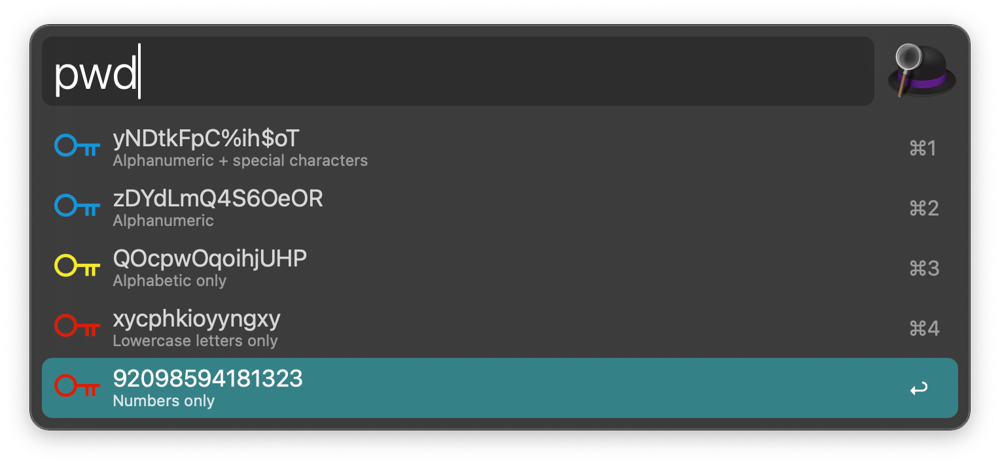

Forked and slightly changed from https://github.com/alfred-workflow-collections/password

# Generate Password
> Randomly Generate Password
> 
> The default length is 14 characters, but the length can be customized.

# How to Use

Download the latest package from the releases, and double-click to install it into Alfred.

Run

```
pwd
```

or f.ex.

```
pwd 20
```


